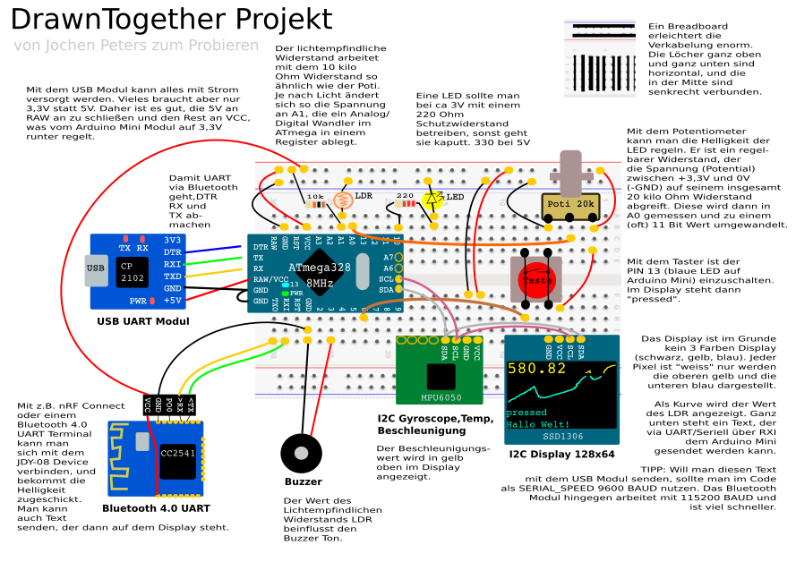
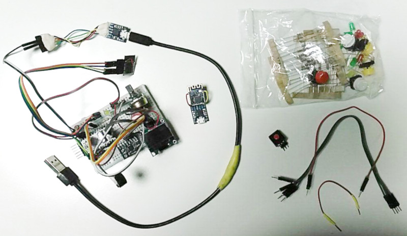

# DrawnTogether

An all in one beginner crash course project with lower than 15 EUR part list. [PDF](drawnTogether.pdf)

## Idee

Ein Mikrocontroller ist ja schön und gut, aber nur eine eingebaute LED kontrollieren 
macht nicht viel Spaß. Folgende Sachen sind auch sehr nützlich:

- Breadboard mit Steckern, LEDs, Widerstände, Taster (2,-)
- 10k Poti, LDR, Schalter (zusammen unter 1,-)
- Lautsprecher oder Buzzer (unter 1,-)
- I2C Display (1,80)
- I2C Bewegungssensor (1,10)
- 2 billige UART Bluetooth Module (je 1,30)
- 2 UART Schnittstelle (1,-) zum Programmieren, Testen, Ausgabe von Werten und Bluetooth Nutzung

Als Mikrocontroller (1,60) kann ich dann nur ein 8MHz Arduino Pro Mini empfehlen. 
Es ist günstig, klein, Robust und leicht zu bedienen. Will man mit 
Schrittmotoren, Servos usw. arbeiten, wird es schnell mal teuer und man muss 
sich mit Gehäusen, Getrieben und passenden Verstärkern auseinander setzen, da 
der Mikrocontroller nicht hohe Ströme schalten kann sondern eher für digitale 
Signale gedacht ist.

## Real World

